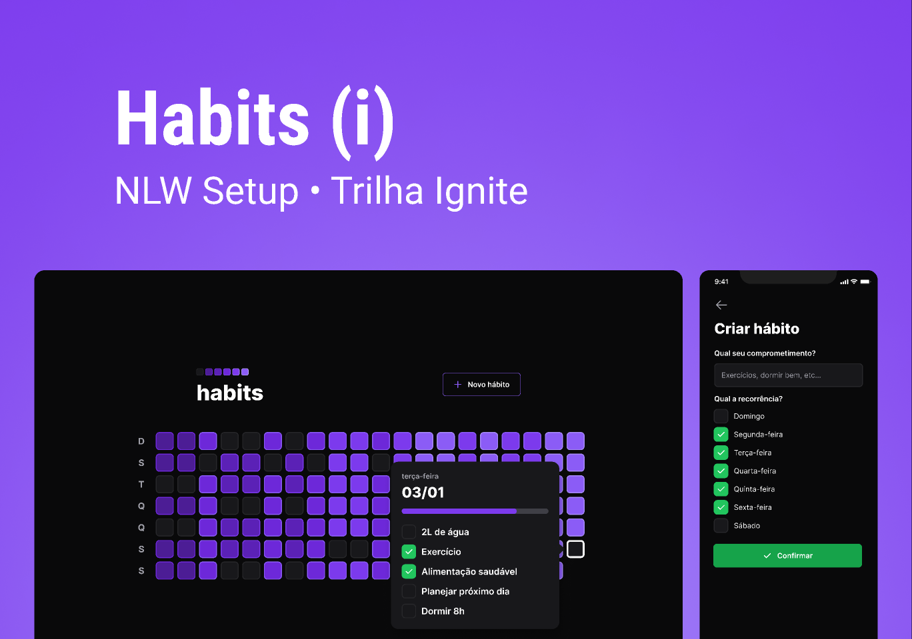

<h1 align="center"> NLW Setup </h1>

Evento exclusivo e gratuito, promovido pela Rocketseat para ensino.

  <a href="#-tecnologias">Tecnologias</a>&nbsp;&nbsp;&nbsp;|&nbsp;&nbsp;&nbsp;
  <a href="#-layout">Layout</a>&nbsp;&nbsp;&nbsp;|&nbsp;&nbsp;&nbsp;
  <a href="#-projeto">Projeto</a>&nbsp;&nbsp;&nbsp;|&nbsp;&nbsp;&nbsp;

  

 

 
## 🧪 Tecnologias

Esse projeto foi desenvolvido usando as seguintes tecnologias:

- [Node](https://nodejs.org/en/)
- [React](https://reactjs.org)
- [React Native](https://reactnative.dev/)
- [TypeScript](https://www.typescriptlang.org/)
- [Fastify](https://www.fastify.io/)
- [Prisma](https://www.prisma.io/)
- [Tailwindcss](https://tailwindcss.com/)
- [NativeWind](https://www.nativewind.dev/)
- [Vite](https://vitejs.dev/)
- [Radix UI](https://www.radix-ui.com/)
- [Expo](https://expo.dev/)

## 🔖 Layout

Você pode visualizar o layout do projeto através do link abaixo:

- [Layout Web/Mobile](https://www.figma.com/community/file/1195326661124171197)

Lembrando que você precisa ter uma conta no [Figma](http://figma.com/).

## 💻 Projeto

O projeto é um Habit tracker.

O projeto foi desenvolvido durante a **[NLW Setup](https://app.rocketseat.com.br/event/nlw-setup)**, apresentada entre os dias 16 e 20 de Janeiro de 2023.

## Idéias para o próximo nível

- [ ] Autenticação (Firebase, Auth0, ...)
- [ ] Notificações Push (mobile) / Service Workers (web)
- [ ] Perfil público com gráfico de resumo
